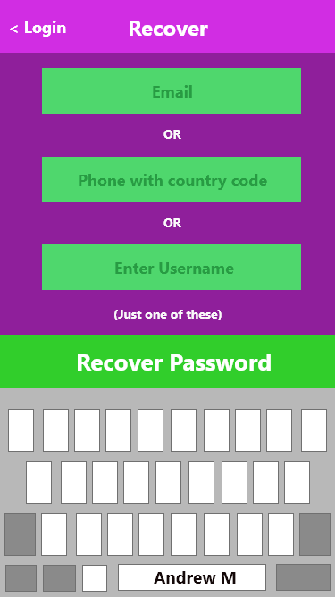
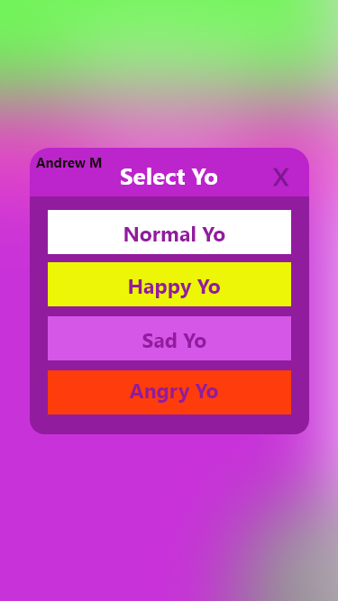

https://github.com/morrissey98/YoMidterm

# Andrew Morrissey

## Analysis

### Ethical Issues:
 1.	One possible ethical issue would be if a large number of child predators began using the app to communicate with children. Those in charge of Yo may need to take some action to prevent this sort of usage.

 2.	Another possible ethical issue could be if the Yo app somehow discriminates against people based on their location or other factors, which is against the ACM Code of Ethics.

 3.	A third ethical issue would be if Yo legally begins using consumer data in a way that is beneficial to Yo but not to the consumer.

### Legal Issues:
1.	A possible legal issue could be if bank robbers decide to use Yo as a form of communication when committing felonies. The creators of Yo would have to find a way to make sure their program is not used maliciously.

2.	The Data Protection Act 2018 provides protection for United Kingdom user data, so the Yo developers have to ensure that the data is used fairly, relevantly, and is kept for no longer than needed.

3.	The Data Protection Act 2018 also states that there must be a way for United Kingdom users to delete their data off Yo, so the developers would have to make sure that feature works correctly to avoid issues.

### Professional Issues:
1.	A professional issue could be if another developer created a similar app to Yo that allowed users to send different kinds of messages before Yo adds that feature, which may be a problem if Yo adds that issue later on.

2.	Another professional issue is if the developers of Yo created an update that they knew was not completely functional, but deployed it anyway and caused problems for users of Yo.

3.	A third professional issue would be if data stored by Yo was not reasonably secured, which is a problem even if the data does not get stolen.

## Screenshots

